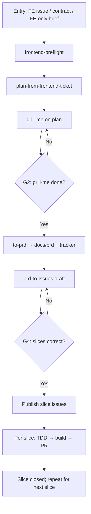

# Implement (`/implement`)

Orchestrates **frontend implementation** after upstream planning (full-stack handoff) or for **FE-only** slices. **Stop only at gates G2 and G4** unless the user asks to pause elsewhere.

**Upstream (separate repo/workflow):** `full-stack-ticket-pipeline` — backend plan, contract (`docs/contracts/{slug}.md`), frontend parent issue. **Do not start `/implement` until preflight passes** (closed backend + OpenAPI), except **FE-only (E)**.

## Pipeline overview



## Stage checklist

Copy and update as you go:

```
Implement progress (slug: ___ / parent FE issue #___):
- [ ] 0. Preflight passed (frontend-preflight) — B+E or E-only
- [ ] 1. FE plan drafted (plan-from-frontend-ticket)
- [ ] 2. G2 — Grill-me complete; PRD approved (to-prd); plan file deleted
- [ ] 3. G4 — Slice breakdown approved (prd-to-issues)
- [ ] 4. Slice issues published to tracker
- [ ] 5. Current slice: TDD → npm run build → PR (one slice at a time)
```

## Entry points (after preflight)

| User says | Start at | Preflight |
|-----------|----------|-----------|
| `/implement` on FE parent **#N** | Stage 0 → 1 | **B+E** unless issue/contract says FE-only |
| `/implement` with **contract path** only | Stage 0 → 1 | **B+E** |
| `/implement FE-only` / no backend in scope | Stage 0 → 1 | **E** — skip backend gate |
| "Grill this plan" | Stage 2 (plan must exist) | Already passed or E-only |
| "Write PRD from plan" | `to-prd` after G2 plan approval | — |
| "Break into issues" | Stage 3 (`prd-to-issues`) | PRD must exist |
| "Implement slice **#M**" | Stage 5 (one child issue) | Slices published |

## Stage 0 — Preflight

**Skill:** `frontend-preflight`

**Gate:** Hard stop if **B+E** fails (backend issue not closed, or OpenAPI missing expected operations). **E-only:** document `**Backend:** None (FE-only)` and proceed.

## Stage 1 — FE implementation plan

**Skill:** `plan-from-frontend-ticket`

**Output:** `docs/plans/{slug}-fe-plan.md` (transient).

**Gate:** None (G1 folded into grill-me). Proceed to grill-me when the draft plan is ready.

## Stage 2 — Grill-me → PRD (G2)

**Skills:** `grill-me`, then `to-prd`

- **grill-me:** One question at a time; revise `docs/plans/{slug}-fe-plan.md` after each resolved decision.
- **End of grill-me:** User signals completion (e.g. "plan looks good", "write the PRD"). Run **`to-prd`** using the grilled plan and session context.
- **PRD:** Write `docs/prd/{slug}.md` and publish to the issue tracker per `to-prd`. User must see and approve the PRD summary in chat before slicing (lightweight check, not a separate checklist gate).
- **Delete plan:** Remove `docs/plans/{slug}-fe-plan.md` once the PRD is approved (**do not** keep two live specs).

**Gate G2:** Do not run `prd-to-issues` until grill-me is done **and** the user approves the PRD.

## Stage 3 — Vertical slices (G4)

**Skill:** `prd-to-issues`

- Source: approved `docs/prd/{slug}.md`.
- Present the proposed slice list; iterate until the user approves.

**Gate G4:** Do not publish issues to the tracker until the user confirms the slice breakdown.

## Stage 4 — Publish slice issues

**Skill:** `prd-to-issues` (publish step)

- Parent reference: frontend parent issue and/or PRD path.
- Apply tracker triage labels per `prd-to-issues`.

## Stage 5 — Per slice: TDD → build → PR

**Skills:** `tdd`; workspace rules for build and PR.

- **One slice at a time** — pick a single child issue (user may name `#M`).
- **TDD:** Red-green-refactor on that slice’s acceptance criteria only.
- **Build:** `npm run build` after the slice is code-complete (`.cursor/rules/task-complete-build.mdc`).
- **PR:** GitHub MCP `create_pull_request` per `github-mcp` skill and user PR rules; link the child issue in the PR body.

No mandatory gate before opening a PR unless the user asks to review the diff first.

## Artifact paths

| Artifact | Path | Lifetime |
|----------|------|----------|
| Frontend contract (input) | `docs/contracts/{slug}.md` | Durable (from full-stack `frontend-contract`) |
| FE implementation plan | `docs/plans/{slug}-fe-plan.md` | **Deleted** after PRD approved |
| PRD | `docs/prd/{slug}.md` | Durable |

## Relationship to full-stack pipeline

| Full-stack stage | This pipeline |
|------------------|---------------|
| 1–3 Backend plan + sync | **Done before** `/implement` |
| 4–5 Contract + approval | **Input** at `docs/contracts/{slug}.md` |
| 6 Frontend parent issue | **Entry** issue #N |
| Implement (this doc) | Preflight → plan → PRD → slices → code |

## Skill index

| Step | Skill | Location |
|------|-------|----------|
| Preflight | `frontend-preflight` | `.cursor/skills/frontend-preflight/` |
| Plan | `plan-from-frontend-ticket` | `.cursor/skills/plan-from-frontend-ticket/` |
| Review | `grill-me` | `.cursor/skills/grill-me/` |
| PRD | `to-prd` | `.cursor/skills/to-prd/` |
| Slices | `prd-to-issues` | `.cursor/skills/prd-to-issues/` |
| Code | `tdd` | `.cursor/skills/tdd/` |
| GitHub issues/PRs | `github-mcp` | `.cursor/skills/github-mcp/` |
| UI polish (optional) | `impeccable` | `.cursor/skills/impeccable/` |

## Rules

- **B+E before start** (full-stack handoff): backend sub-issue **closed** and relevant operations present in **published OpenAPI** (`docs/DESIGN.md` URL).
- **FE-only (E):** same pipeline shape; preflight skips backend checks; plan header `**Backend:** None (FE-only)`.
- **Never** run `prd-to-issues` before PRD approval at end of G2.
- **Never** keep `docs/plans/*` after the PRD is approved — delete the plan file.
- **One slice per** TDD → build → PR cycle unless the user explicitly combines slices.
- Read `docs/DESIGN.md` and OpenAPI before API or routing work; match kitchen-sink patterns for UI.
- Do not skip **G2** or **G4** without explicit user instruction.
