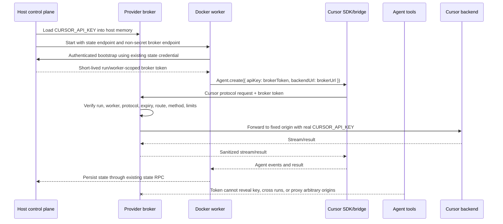

# Cursor credential delivery through a host provider proxy

## Status

Implementation plan. This plan follows ADR 0017 and the credential decision in
`docker-only-state-service.md`.

Secret-file delivery is not a fallback. The real Cursor probe observed exact
API-key bytes in provider-visible output after a direct read attempt, and the
worker and Cursor tools share UID 10001. Production must remain fail-closed
until the proxy contract and its replacement proof pass.

### 2026-08-15 verification update

Contract v8 / proxy v5 completed the live SDK lifecycle on Windows Docker
Desktop for proof identity `b96436cfc9aa9260`: all seven lifecycle phases,
BidiAppend upload, and RunSSE download were green, with the host key absent
from worker delivery and output. Credential-free automated checks now cover
the production-equivalent recorder's environment/mount/argv boundary and the
broker capability's cross-run, cross-worker, expired, revoked, wrong-protocol,
state-route, absolute-URL, `CONNECT`, redirect, oversized-body, and
concurrency failures.

The replacement proof still does not contain direct and delegated agent search
phases. The historical credential-isolation probe cannot satisfy that
requirement because it deliberately mounts the real key to test the rejected
secret-file design. A future credential-gated run must add direct and
delegated searches to the host-proxy proof itself and record only absence
booleans; do not rerun the secret-file probe or treat credential-free topology
tests as behavioral agent evidence. Native Linux `host-gateway` remains a
separate CI lane.

## Outcome

Run the Cursor SDK in the Docker worker without placing `CURSOR_API_KEY` in the
container, image, workspace, run state, Docker arguments, environment, mounted
files, or agent-visible output. A trusted host service owns the key and
forwards only the Cursor backend protocol needed by the pinned SDK.

The first implementation is a constrained reverse proxy, not a new provider
API invented by the harness:

- the worker points the SDK at a per-run host proxy URL;
- the worker gives the SDK a short-lived, run-scoped broker token instead of
  the Cursor key;
- the proxy authenticates and authorizes that token, removes it from the
  upstream request, injects the real Cursor credential, and forwards to a
  fixed Cursor origin;
- no response, error, redirect, log, or diagnostic may include the real key.

Treat the broker token as agent-readable. It is a capability to use the
provider for one run, not a secret whose confidentiality forms the key
boundary.

## Constraints already established

- Worker code and Cursor agent tools run as UID 10001.
- Mode bits cannot make a worker-readable file unreadable to those tools.
- `docker-worker-session.ts` currently calls
  `assertCursorCredentialProbePassed(undefined, imageDigest)` before writing
  the key. Because secret-file support is unconditionally false, a real Cursor
  worker fails before key materialization.
- `run-worker.ts` and `cursor-backend.ts` still model the Cursor key as a worker
  dependency. That model must be removed for Docker production.
- The host state API already provides a container-reachable listener at
  `host.docker.internal`, protocol versioning, per-run credentials, and route
  dispatch separate from dashboard authentication.
- The hardened container already adds
  `host.docker.internal:host-gateway`. Docker Desktop networking on Windows
  still needs a real integration proof.
- The repository pins `@cursor/sdk` `~1.0.27`.
- Pinned SDK 1.0.27 exposes `local.useHttp1ForAgent` and documents the
  process-level `CURSOR_BACKEND_URL` seam, but its public `AgentOptions` type
  does **not** contain `backendUrl`. The worker adapter therefore uses the
  process seam and does not rely on an ignored extra option. The SDK still does
  not document an injectable custom fetch or transport for agent execution.
  Exact create/send/stream/resume/cancel behavior must be recorded before
  production is enabled.

## Architecture options, ranked

### 1. Host HTTPS Cursor protocol proxy — recommended

Keep `CURSOR_API_KEY` in the trusted host process. Point the worker SDK to an
HTTPS endpoint on `host.docker.internal`. Give the SDK a separate broker token;
the host validates it and substitutes the real upstream authorization.

Why this ranks first:

- it satisfies ADR 0017's host-owned credential boundary;
- the real key never crosses the container boundary;
- it works at the SDK's documented backend URL seam;
- it preserves local-agent execution, streaming, cancellation, resume, usage,
  and provider IDs without moving workspace tools to the host;
- it can be shipped behind a versioned, fail-closed provider contract.

Costs and limits:

- the proxy must faithfully support every HTTP/2 or HTTP/1.1/SSE endpoint used
  by create, send, wait/stream, cancel, resume, conversation, and disposal;
- SDK/backend protocol changes can break it, so the SDK version and proxy
  contract need compatibility tests;
- TLS trust and `host.docker.internal` differ between native Linux Docker and
  Docker Desktop;
- a stolen broker token can consume provider operations until expiry. It must
  not reveal the Cursor key or authorize host state, another run, or a general
  forward proxy.

### 2. SDK-level custom transport — adopt only if Cursor exposes a supported seam

An injected `fetch`/transport could rewrite authorization in a host-owned
client, but code executing inside the worker cannot inject a host-owned
authorization header without contacting a host broker anyway. The currently
documented TypeScript surface provides backend URL selection, not a custom
agent transport.

Use this only if the pinned SDK exposes and Cursor supports a transport that:

1. can execute on the host while local tools still execute in the worker;
2. preserves all streaming and lifecycle methods;
3. never serializes the real key into the worker or SDK bridge; and
4. has a stable public contract.

Otherwise it merely moves reverse-proxy code into an unsupported SDK hook and
is harder to compatibility-test.

### 3. Split worker and tool UIDs plus kernel isolation — defense in depth, not the fix

Running the orchestrator and tool sandbox under different UIDs, combined with
Landlock/user namespaces/seccomp, could protect selected files. It is not the
credential delivery design:

- the SDK bridge and tool process topology is SDK-owned and must be proven
  stable across versions;
- a process that must pass the key to an SDK child still risks argv,
  environment, IPC, `/proc`, crash-dump, and tracing exposure;
- Landlock is Linux-kernel dependent and does not create a reliable product
  contract across Docker Desktop hosts;
- changing UID alone does not constrain delegated tools or provider events.

Track UID separation as later hardening for state/RPC bootstrap capabilities,
not as permission to restore Cursor key files.

### 4. Disable filesystem or shell tools — rejected as a credential boundary

Tool allowlists reduce product capability and do not protect against SDK bugs,
new tools, delegated tasks, process inspection, provider-event leakage, or
incorrect policy application. The harness needs filesystem tools to do useful
work. This may remain a role-level product control, but it cannot gate key
delivery.

### 5. Continue mounting with stricter file modes — rejected

The worker and tools share UID 10001. The failed direct-read proof already
disproves this option. Do not add an override.

## Recommended data flow

The host may serve the state API and provider API from the same HTTP server and
port initially, but they must use different prefixes, protocol headers,
credential types, route handlers, and audit records. Keep the proxy module
separable so it can move to a dedicated listener without changing the worker
contract.

## Threat model and security invariants

### Trusted

- host control process and host memory;
- host configuration source containing `CURSOR_API_KEY`;
- fixed proxy implementation and pinned Cursor upstream configuration;
- the Cursor backend as the intended recipient of the key.

### Untrusted or potentially agent-controlled

- target repository and all files under `/workspace`;
- prompts, model output, direct tools, delegated tasks, and project commands;
- worker/container filesystem, environment, argv, stdout/stderr, diagnostics,
  crash reports, and exported artifacts;
- inbound proxy paths, headers, bodies, redirects, and malformed streams;
- the broker token after it is delivered to the worker.

### Required invariants

1. Agent tools must never see the Cursor API key or an equivalent reusable
   Cursor credential, including exact bytes, substrings, fingerprints useful
   for guessing, authorization headers, URLs, errors, or logs.
2. The real key exists only in host memory and the outbound host-to-Cursor TLS
   request. Do not persist it in broker records.
3. The worker may hold the short-lived broker token in memory. The SDK bridge
   may receive that token because it is the presented `apiKey`. Neither may
   receive the real key.
4. Assume tools can obtain the broker token. Authorization therefore limits
   blast radius by run ID, worker instance, protocol version, expiry, allowed
   Cursor operations, request size/rate/concurrency, and fixed upstream.
5. The proxy never implements `CONNECT`, accepts absolute target URLs, follows
   redirects to a different origin, forwards caller-supplied authorization, or
   exposes response headers that could carry credentials.
6. Provider tokens and state credentials are not interchangeable. A provider
   token cannot call state routes; a state token is used only for the
   authenticated bootstrap exchange and never forwarded to Cursor routes.
7. Proxy logs contain request ID, run ID, worker instance, operation class,
   status, byte counts, timing, and redacted failure classification only.
   Prompt bodies, response bodies, authorization, cookies, and query secrets
   are excluded.
8. Host shutdown, worker replacement, run settlement, or credential rotation
   revokes the provider capability and disposes active upstream streams.

This design protects the Cursor credential. It does not claim that the current
state/RPC secret files are unreadable to same-UID tools. Their capabilities and
delivery need a separate hardening review; do not reuse them as the provider
token.

## Provider protocol and authentication

Add an independently versioned provider protocol, for example:

- prefix: `/provider-api/v1/runs/:runId/cursor/*`;
- auth: `x-harness-provider-token`;
- version: `x-harness-provider-protocol`;
- request correlation: `x-request-id`.

Use a separate `WorkerProviderCredentialIssuer` modeled on
`WorkerStateCredentialIssuer`:

- generate at least 256 random bits;
- persist only a hash and metadata outside the run directory;
- bind to run ID, worker instance ID, provider `cursor`, protocol version, and
  optionally the pinned SDK/image compatibility tuple;
- use a short TTL (start at 15 minutes) and renew while the worker lease is
  valid;
- revoke previous generations on worker replacement and revoke at stop/settle;
- validate hashes in constant time;
- enforce per-run concurrency and rate ceilings at the proxy.

Do not reuse the state credential as the ongoing proxy credential. Reuse would
couple provider compromise to state mutation, make independent rotation
impossible, and prevent least-privilege auditing.

For initial delivery, add a typed bootstrap exchange authenticated by the
existing state credential. The host returns a provider endpoint, public TLS
trust material/fingerprint, token, expiry, and provider protocol version. Keep
the token only in worker memory and pass it explicitly to the SDK; never set
`CURSOR_API_KEY`. A later host-initiated or mutually authenticated bootstrap can
replace this exchange without changing proxy authorization.

Because the state credential is currently file-mounted and may be same-UID
readable, the exchange is not proof that only the orchestrator can acquire a
provider token. The provider token must remain safe under theft as described
above.

## TLS and networking

Use HTTPS even though the route crosses a local Docker bridge. Plain HTTP would
expose the broker token, prompts, and responses to local network observers.

Implementation spike:

1. Bind the provider listener on the host interface reachable from the
   container, never a public interface selected by repository input.
2. Generate or load a host-owned local CA/server certificate with
   `host.docker.internal` in the SAN. Persist only certificate material in
   harness-owned state; protect the CA/server private key as host state.
3. Deliver the public CA or SPKI fingerprint in the worker image/bootstrap and
   configure the SDK bridge's TLS trust without disabling verification.
4. Prove Windows Docker Desktop and Linux `host-gateway` resolution.
5. If the SDK bridge cannot use the supplied CA or cannot accept the HTTPS
   backend URL, stop. Do not fall back to `NODE_TLS_REJECT_UNAUTHORIZED=0`.

The proxy chooses an exact Cursor production origin per allowed operation from
installed harness code. SDK 1.0.27 model discovery maps only
`GET /v1/models` to `https://api.cursor.com/`; API-key exchange and local
AgentService RPCs map to `https://api2.cursor.sh/`. Repository config, worker
input, URL path, `Host`, forwarded headers, and redirects cannot select an
upstream, and no wildcard `/v1/*` passthrough exists.

## Phase 0: prove the pinned SDK seam

Before building the full service, write a disposable contract spike for
`@cursor/sdk` 1.0.27:

1. Inspect the installed public types and runtime behavior for `backendUrl` on
   `Agent.create` and `Agent.resume`. Determine whether explicit options or
   `CURSOR_BACKEND_URL` are required.
2. Run create, send with streaming callbacks, wait, resume, conversation,
   cancel, and disposal against a recording TLS endpoint.
3. Record methods, relative paths, HTTP versions, streaming format, required
   headers, redirects, and any secondary Cursor origins or websocket
   connections.
4. Verify that supplying a broker token as `apiKey` sends only that token to
   the configured backend and does not trigger browser/stored-login fallback.
5. Verify custom CA trust and `host.docker.internal`.
6. Decide whether `local.useHttp1ForAgent` is required. Prefer the documented
   HTTP/1.1/SSE mode if it reduces proxy complexity without losing features.

Produce a versioned allowlist fixture from observations, but do not log request
or response bodies from real runs. If any provider connection bypasses
`backendUrl`, the recommended design is blocked pending a supported Cursor SDK
mechanism.

## Concrete code changes

Names are proposed and may be adjusted to existing conventions.

### New host/provider modules

- `src/worker/provider-protocol.ts`
  - protocol constants, headers, bootstrap and error envelopes, safe path
    builders, and compatibility tuple types.
- `src/application/worker-provider-credentials.ts`
  - independent issuer, verifier, renewal, revocation, hashed records, and
    run/worker scoping.
- `src/infrastructure/provider-proxy/cursor-provider-proxy.ts`
  - constrained reverse proxy, upstream auth substitution, path/method
    allowlist, streaming, redirect rejection, limits, and redaction.
- `src/infrastructure/provider-proxy/cursor-provider-contract.ts`
  - pinned SDK compatibility manifest and operation classification.
- `src/infrastructure/provider-proxy/tls.ts`
  - host certificate lifecycle and public trust bundle/fingerprint handling.
- `src/ui/http/routes/worker-provider.ts`
  - provider-token bootstrap/renewal and proxy dispatch, separate from state
    and dashboard routes.

### Existing production modules

- `src/ui/server.ts`
  - compose provider issuer/proxy with the host profile;
  - expose the container-reachable HTTPS endpoint;
  - revoke credentials and close streams during teardown.
- `src/vnext/profiles/index.ts` and credential/provider plugin contracts
  - register the host provider broker as a required trusted service;
  - fail profile validation if real Cursor is selected without it.
- `src/application/docker-worker-session.ts`
  - remove Cursor key file creation and mount fields entirely;
  - pass only non-secret provider endpoint/protocol metadata;
  - keep argv/env key-leak assertions;
  - require a green provider-proxy proof before starting a real worker.
- `src/infrastructure/container/container-spec.ts`
  - update stale secret-file remediation text;
  - add only public CA/trust configuration if required;
  - validate the fixed host alias and reject TLS-disable environment flags.
- `src/worker/run-worker.ts`
  - delete production calls to `resolveWorkerCursorApiKey`;
  - acquire/renew a provider capability after authenticated bootstrap;
  - construct the Cursor backend with broker endpoint/token;
  - clear references and revoke on shutdown.
- `src/infrastructure/agents/cursor-backend.ts`
  - replace the raw `apiKey` parameter with a typed Cursor connection:
    `{ brokerToken, backendUrl, tlsTrust, compatibility }`;
  - pass broker token explicitly as `apiKey` and proxy URL explicitly as the
    SDK backend override on create and resume;
  - prohibit ambient `CURSOR_API_KEY` and stored-login fallback in Docker mode.
- `src/worker/cursor-api-key-secret.ts`
  - remove worker key resolution and key file helpers after diagnostic
    migration; retain only generic argv leak detection if still useful, under
    a name that no longer recommends secret-file delivery.
- `src/worker/protocol.ts`
  - remove `CURSOR_API_KEY_SECRET_CONTAINER_PATH` after old diagnostics no
    longer compile against it.
- `src/application/execution-runtime-status.ts`
  - replace `cursorCredential.passed` secret-file semantics with broker
    configured/reachable/compatible/proven fields and actionable blockers.
- `src/cli/create-cli.ts`
  - replace the production-facing credential smoke with
    `cursor-provider-smoke`;
  - remove `worker --cursor-secret-file`;
  - report host-only key custody, proxy compatibility, TLS/network status, and
    proof identity.
- `src/ui/client/render-run.ts`, `INSTALL.md`, agent-harness `README.md`, ADR
  0017, and the Docker state-service plan
  - update operator remediation and mark the old probe as historical evidence.

### Tests and fixtures

- `tests/unit/worker-provider-credentials.test.ts`
- `tests/unit/cursor-provider-proxy.test.ts`
- `tests/unit/cursor-backend.test.ts`
- `tests/integration/worker-provider-routes.test.ts`
- `tests/docker/cursor-provider-proxy.test.ts`
- `tests/docker/cursor-provider-contract.test.ts`
- a fake Cursor upstream supporting bounded streaming, cancellation, resume,
  malformed responses, redirects, and credential canaries.

Do not delete the old failed report/cache reader until migration diagnostics
can explain why secret-file proofs no longer enable anything.

## Replacement isolation proof

The old question was “can direct and delegated tools read this secret path?”
There must be no Cursor secret path in the new design. Replace it with a
provider-boundary smoke whose cache key includes:

- worker image digest;
- pinned `@cursor/sdk` version;
- provider protocol and compatibility-manifest versions;
- proxy implementation version;
- model;
- TLS trust identity.

The proof identity deliberately excludes the host API key. The proof establishes
the worker image, sandbox, SDK, proxy, TLS, and contract boundary; changing the
host-held credential does not change those properties. Authentication remains
part of the live smoke so a green proof demonstrates one successful upstream
hop, but a later invalid, expired, or revoked key is an ordinary runtime
authentication failure rather than an isolation failure. Neither raw key bytes
nor a key fingerprint are persisted.

The smoke passes only when all of these are observed:

1. A real Cursor agent completes through the host proxy.
2. Proxy audit evidence shows the real key was injected only on the host
   upstream hop.
3. Container inspect, mounts, argv, environment, `/run/secrets`, `/proc`
   views available to UID 10001, workspace, logs, events, final responses, and
   exports contain neither exact key bytes nor a key-shaped value.
4. Direct and delegated agents are instructed to locate the key using their
   available tools; both complete without observing it. Their cooperation is
   defense-in-depth evidence, not the primary boundary.
5. A canary broker token can invoke only the allowed run-scoped provider
   surface; cross-run, expired, revoked, wrong-protocol, state-route, absolute
   URL, `CONNECT`, redirect, oversized-body, and excessive-concurrency attempts
   fail.
6. A recording upstream proves caller authorization was stripped and the host
   inserted exactly one upstream authorization value.
7. Create/send/stream/wait/resume/cancel/dispose work through the proxy.
8. Windows Docker Desktop reaches and validates the proxy at
   `host.docker.internal`; native Linux with `host-gateway` is a separate lane.
9. Proxy and host restarts fail closed, revoke stale tokens, and never silently
   send the broker token to Cursor production.

The test report stores booleans, versions, operation classifications, request
IDs, and redacted failure categories only. No prompt, response body, broker
token, real key, or authorization header is retained.

## Migration and fail-closed behavior

1. Leave `CURSOR_SECRET_FILE_DELIVERY_SUPPORTED = false` and the unconditional
   production block in place while the SDK spike and proxy are developed.
2. Add the proxy behind an explicit development flag and fake upstream first.
   The flag must not re-enable secret files.
3. Land proxy protocol, credential issuer, TLS, worker adapter, and tests.
4. Add `cursor-provider-smoke`. It may consume the host `CURSOR_API_KEY`, but
   only the host proxy process can read it.
5. Gate real Docker workers on a matching green proxy proof. Missing,
   malformed, wrong-image, wrong-SDK, wrong-protocol, wrong-contract,
   wrong-proxy, wrong-model, wrong-TLS, or skipped real-provider evidence blocks
   the run. Proofs do not expire by age and survive host key rotation.
6. After the required Docker and provider-contract lanes pass, switch Docker
   production from “unsupported credential delivery” to “host proxy ready.”
7. Remove key mounts, worker key readers, `--cursor-secret-file`, and the old
   secret-path smoke command. Keep a durable historical failure explanation.
8. Remove stale bootstrap key files if present, without reading/logging them,
   and verify no container references the old mount.

CLI/status messages:

- key absent: “Host Cursor credential is not configured; deterministic runs
  remain available.”
- proxy unavailable: “Real Cursor runs are blocked: host provider proxy is not
  listening/reachable.”
- SDK mismatch: “Pinned Cursor SDK has no green provider-proxy contract for
  this image.”
- proof missing: show the exact smoke command and compatibility tuple.
- ready: “Cursor credential custody: host proxy; key not delivered to worker.”
- never recommend restoring `/run/secrets` or setting `CURSOR_API_KEY` in the
  container.

## Test plan

### Unit

- provider token issue, hash-at-rest, scope, TTL, renewal, rotation, revocation,
  constant-time verification, and protocol mismatch;
- route/method/host/header allowlists and canonicalization, including encoded
  traversal, duplicate authorization, hop-by-hop headers, absolute URLs,
  redirects, `CONNECT`, body limits, timeouts, and concurrency/rate limits;
- upstream auth replacement and response/error redaction with exact-key and
  key-shaped canaries;
- streaming backpressure, abort propagation, client disconnect, and host
  shutdown;
- Cursor backend always supplies broker token/backend URL on create and resume,
  never resolves ambient credentials, and preserves retained sessions;
- runtime status and CLI render every fail-closed state.

### Integration

- real host HTTP/TLS server plus fake Cursor upstream and worker client;
- state-authenticated provider-token bootstrap followed by provider calls;
- prove provider token cannot call state API and state token is rejected by
  provider API;
- host restart and worker replacement revoke stale generations;
- proxy audit contains metadata only;
- dashboard-disabled headless host still serves state and provider APIs.

### Docker

- hardened worker reaches HTTPS proxy through `host.docker.internal`;
- no Cursor key in container inspect, env, argv, mounts, filesystem, `/proc`
  surfaces available to the worker, or exported workspace;
- direct and delegated search phases observe no key;
- a real local Cursor run edits/verifies the named volume through the proxy;
- cancellation, resume, worker restart, and proxy disconnect behave
  predictably;
- run on Windows Docker Desktop and native Linux host-gateway.

### Provider contract

- credential-gated and separate from deterministic acceptance;
- no skip is success: missing key, image, TLS support, delegated phase, or
  Docker availability fails the required lane;
- exercise every SDK operation used by `cursor-backend.ts`;
- pin report to image digest, exact SDK version, proxy contract, TLS identity,
  and model;
- use a restricted service-account key where available and enforce a bounded
  spend/time budget.

## Sequenced implementation todos

### Phase A — contract discovery

- [ ] Verify `backendUrl` behavior on create and resume for SDK 1.0.27.
- [ ] Record all backend connections and streaming requirements.
- [ ] Prove custom CA trust from the maintained Linux image on Windows and
      Linux hosts.
- [ ] Decide HTTP/2 passthrough versus documented HTTP/1.1/SSE mode.
- [ ] Freeze provider protocol v1 and Cursor endpoint allowlist.

Exit: a fake TLS endpoint can satisfy every SDK operation the harness uses,
and no secondary connection bypasses it.

### Phase B — host broker foundation

- [x] Implement provider credentials and protocol types.
- [x] Implement constrained proxy with fake upstream.
- [x] Add host-owned CA/server certificate lifecycle, a dedicated HTTPS
      listener, public-CA delivery, redacted audit, and teardown.
- [x] Replace buffered proxy request/response handling for the exact
      `POST /aiserver.v1.BidiService/BidiAppend` route with bounded Connect
      streaming, backpressure, first-byte forwarding, and bidirectional abort
      propagation. SDK 1.0.27 uses HTTP/1.1 Connect streaming
      (`application/connect+proto` or `application/connect+json`) on this route;
      bodies remain opaque and are never logged.
- [x] Compose the explicit fake-upstream development broker into the headless
      host server (production composition remains blocked on TLS/contract proof).
- [x] Add unit and integration tests for authentication, credential separation,
      adversarial routing, authorization substitution, redaction, and teardown.

Exit: a synthetic broker token can use only the intended fake-provider surface;
the fake upstream alone sees the injected canary key.

### Phase C — worker integration

- [x] Add authenticated token bootstrap and replacement renewal. Renewal
      revokes the prior generation and disposes retained SDK agents before the
      replacement is used; live active-stream behavior remains a proof item.
- [x] Change Cursor backend construction to broker connection options.
- [x] Remove production worker key reads and secret mount plumbing (historical
      failed-boundary diagnostic helpers remain isolated).
- [x] Pass the HTTPS endpoint/trust identity and mount only the public CA via
      `NODE_EXTRA_CA_CERTS`, preserving Docker hardening.
- [x] Update lifecycle revocation and fail-closed status reporting.

Exit: the Docker worker completes the fake-provider flow with no real-key
material in the container.

### Phase D — replacement proof

- [x] Implement the redacted, release-tuple-scoped provider contract
      report/cache. The live recorder launches pinned SDK 1.0.27 in a disposable
      digest-pinned Linux worker container at `/workspace`, with the production
      sandbox/seccomp/capability topology, `CURSOR_BACKEND_URL`, a run-scoped
      broker token, and public CA trust. The host `CURSOR_API_KEY` is never part
      of the container environment, argv, mounts, image, or workspace.
- [ ] Add direct/delegated absence checks and capability-abuse checks.
- [x] Wire create/send/stream/wait/resume/cancel/dispose recording against real
      Cursor. Every lifecycle operation is required for green evidence; an
      unsupported stream or cancel capability remains an explicit fail-closed
      gap.
- [ ] Add Windows Docker Desktop and Linux provider-contract lanes.
- [x] Make real Cursor startup require a matching green report.

Exit: required CI/provider evidence is green for the exact release tuple.

### Phase E — cutover and cleanup

- [x] Change runtime readiness and `cursor-provider-smoke` from unconditional
      unsupported to matching proof-cache evaluation. Production remains
      fail-closed until a release-tuple-matching proof has all seven lifecycle
      phases green.
- [ ] Remove `--cursor-secret-file`, key path constants, mount writers/readers,
      and obsolete tests.
- [ ] Update docs, ADR consequences, installation guidance, CLI, and UI hints
      (CLI, INSTALL, README, and runtime status shipped; ADR/UI cutover waits
      for the production HTTPS proof).
- [ ] Delete stale host bootstrap key files safely and test upgrade behavior.
- [ ] Review state/RPC same-UID capability exposure as a separate hardening
      item.

Exit: no production code path can deliver the Cursor key to a worker, and
operators receive one unambiguous remediation path.

## Open risks and stop conditions

- **SDK support:** Documentation indicates backend URL selection but not a
  custom agent transport. If 1.0.27 does not apply the override to every local
  agent operation, stop and request a supported Cursor SDK seam.
- **Authorization shape:** The SDK may validate key format locally or use the
  key in a handshake the proxy cannot safely substitute. Test an opaque,
  non-Cursor-shaped broker token. Do not make the broker token resemble a real
  Cursor key unless the SDK requires it, and document that constraint.
- **Multiple origins:** Cursor local agents may contact cloud, telemetry,
  artifact, websocket, or auth endpoints outside the configured backend.
  Identify each connection. Any connection needing the real key must traverse
  the broker; unrelated telemetry should carry no broker or real credential.
- **Streaming compatibility:** HTTP/2, SSE, websocket upgrades, trailers,
  compression, and cancellation can be subtly broken by a reverse proxy.
- **TLS trust:** The SDK bridge may not inherit Node trust configuration.
  Disabling verification is forbidden.
- **Windows networking:** `host.docker.internal` generally exists on Docker
  Desktop, but listener binding, firewall prompts, IPv4/IPv6 selection, SAN
  validation, and port reuse require real tests.
- **Native Linux networking:** `host-gateway` support depends on Docker
  version. Readiness must detect unsupported engines.
- **Agent-readable broker token:** Same-UID tools may recover the capability.
  Rate, scope, TTL, and revocation limit abuse, but cannot prevent an active
  agent from consuming its own allowed provider budget.
- **State credential exposure:** The existing mounted state/RPC tokens likely
  share the same UID weakness. They are not reused here, but need independent
  threat analysis.
- **Prompt visibility:** The trusted host proxy sees provider request and
  response bytes. It must stream without persistence and exclude bodies from
  logs.
- **Key rotation:** Rotation must revoke active upstream sessions without ever
  comparing or logging plaintext outside host memory. It does not invalidate
  the isolation proof; an unusable replacement key fails normal upstream
  authentication.
- **Operational availability:** The host proxy becomes required for the life
  of each real run. Recovery must distinguish retryable proxy interruption
  from protocol incompatibility and credential revocation.

None of these risks permits falling back to a worker-readable Cursor
credential. Until the relevant stop conditions are resolved and the new smoke
is green, real Cursor Docker runs remain blocked.
